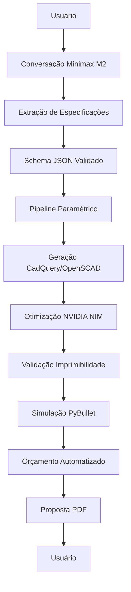

# Arquitectura 3dPot Evolutiva - Sistema de Prototipagem Sob Demanda

**Versão:** 2.0.0  
**Data:** 11 de novembro de 2025  
**Autor:** MiniMax Agent  

## Visão Geral da Evolução

A plataforma 3dPot evoluirá de um sistema IoT de controle para uma **plataforma completa de prototipagem sob demanda**, preservando funcionalidades legadas enquanto adiciona capacidades avançadas de IA conversacional, geração automatizada de modelos 3D e simulação.

## Princípios Arquiteturais

### 1. **Preservação de Legados**
- Códigos críticos: `codigos/esp32/`, `codigos/arduino/`, `codigos/raspberry-pi/`
- APIs embarcadas existentes mantidas
- Dashboards web locais preservados
- Tópicos MQTT e protocolos legados

### 2. **Arquitetura Monolítica Modular**
```
┌─────────────────────────────────────────────────────────────┐
│                    API Gateway (FastAPI)                    │
├─────────────────────────────────────────────────────────────┤
│  ┌───────────────┐ ┌───────────────┐ ┌───────────────┐      │
│  │ Conversação   │ │  Geração 3D   │ │   Simulação   │      │
│  │   Minimax M2  │ │   Paramétrica │ │   PyBullet    │      │
│  └───────────────┘ └───────────────┘ └───────────────┘      │
├─────────────────────────────────────────────────────────────┤
│  ┌───────────────┐ ┌───────────────┐ ┌───────────────┐      │
│  │Orçamento Auto │ │    Storage    │ │   Autenticação│      │
│  │ Octopart API  │ │  S3/MinIO     │ │   JWT/OAuth2  │      │
│  └───────────────┘ └───────────────┘ └───────────────┘      │
├─────────────────────────────────────────────────────────────┤
│                   Service Layer                             │
├─────────────────────────────────────────────────────────────┤
│ Legacy Hardware │ Legacy APIs  │ Legacy Storage │ Legacy Web │
└─────────────────────────────────────────────────────────────┘
```

### 3. **Stack Tecnológico**

#### Backend Evolutivo
- **Python 3.10+** - Linguagem principal
- **FastAPI** - Framework web de alta performance
- **Pydantic** - Validação de dados e schemas
- **SQLAlchemy 2.0** - ORM para PostgreSQL
- **Alembic** - Migrações de banco
- **Celery + Redis** - Processamento assíncrono
- **WebSockets** - Comunicação em tempo real

#### Frontend Evolutivo
- **React 18** - Framework principal
- **TypeScript** - Tipagem estática
- **React Three Fiber** - Visualização 3D
- **Three.js** - Engine 3D
- **Tailwind CSS** - Styling
- **React Query** - Gerenciamento de estado servidor
- **Framer Motion** - Animações

#### Infraestrutura
- **PostgreSQL 15** - Banco relacional
- **S3/MinIO** - Object storage para modelos 3D
- **Redis** - Cache e sessões
- **Prometheus** - Métricas
- **Grafana** - Observabilidade
- **Docker** - Containerização
- **GitHub Actions** - CI/CD

#### APIs Externas
- **Minimax M2 API** - Conversação inteligente
- **NVIDIA NIM** - Otimização de malha 3D (se disponível)
- **Octopart API** - Componentes eletrônicos
- **DigiKey API** - Preços de componentes
- **Slant 3D API** - Geração de modelos

## Estrutura de Diretórios Evolutiva

```
3dpot-v2/
├── backend/                          # Backend FastAPI evolutivo
│   ├── api/
│   │   ├── v1/                       # API versionada
│   │   │   ├── __init__.py
│   │   │   ├── conversational.py     # Endpoints conversação
│   │   │   ├── modeling.py           # Endpoints modelagem
│   │   │   ├── simulation.py         # Endpoints simulação
│   │   │   ├── budgeting.py          # Endpoints orçamento
│   │   │   └── projects.py           # Endpoints projetos
│   │   └── dependencies.py
│   ├── core/
│   │   ├── __init__.py
│   │   ├── config.py                 # Configurações
│   │   ├── security.py               # JWT, OAuth2
│   │   └── database.py               # Conexão DB
│   ├── models/
│   │   ├── __init__.py
│   │   ├── user.py                   # Modelos de usuário
│   │   ├── project.py                # Modelos de projeto
│   │   ├── conversation.py           # Conversas
│   │   ├── model_3d.py               # Modelos 3D
│   │   └── budget.py                 # Orçamentos
│   ├── schemas/
│   │   ├── __init__.py
│   │   ├── project.py                # Schemas Pydantic
│   │   ├── conversation.py
│   │   └── model_3d.py
│   ├── services/
│   │   ├── __init__.py
│   │   ├── conversational_service.py # Minimax M2
│   │   ├── modeling_service.py       # CadQuery/OpenSCAD
│   │   ├── simulation_service.py     # PyBullet
│   │   ├── budgeting_service.py      # Octopart
│   │   ├── storage_service.py        # S3/MinIO
│   │   └── ai_service.py             # NVIDIA NIM
│   ├── integrations/
│   │   ├── __init__.py
│   │   ├── minimax_api.py
│   │   ├── octopart_api.py
│   │   ├── nvidia_nim.py
│   │   ├── openscad_engine.py
│   │   ├── cadquery_engine.py
│   │   └── trimesh_processor.py
│   ├── utils/
│   │   ├── __init__.py
│   │   ├── validation.py
│   │   ├── file_utils.py
│   │   └── mesh_utils.py
│   └── main.py                       # Aplicação FastAPI
│
├── frontend/                         # Frontend React evolutivo
│   ├── src/
│   │   ├── components/
│   │   │   ├── conversation/         # Chat interface
│   │   │   ├── modeling/             # Visualização 3D
│   │   │   ├── simulation/           # Simulação
│   │   │   └── budgeting/            # Orçamentos
│   │   ├── hooks/
│   │   │   ├── useConversational.ts  # Hook conversação
│   │   │   ├── useModeling.ts        # Hook modelagem
│   │   │   └── useSimulation.ts      # Hook simulação
│   │   ├── services/
│   │   │   ├── api.ts                # Cliente API
│   │   │   ├── websocket.ts          # WebSocket client
│   │   │   └── storage.ts            # Storage service
│   │   ├── types/                    # TypeScript types
│   │   ├── utils/                    # Utilitários
│   │   └── App.tsx
│   └── public/
│
├── legacy/                           # Preservação de legados
│   ├── codigos/                      # Hardware legados
│   ├── interface-web/                # Web antigo preservado
│   ├── central-inteligente/          # Sistema central antigo
│   └── modelos-3d/                   # Modelos existentes
│
├── tests/                            # Testes automatizados
│   ├── unit/
│   ├── integration/
│   ├── e2e/
│   └── performance/
│
├── docs/                             # Documentação
│   ├── api/                          # Documentação API
│   ├── architecture/                 # ADRs
│   ├── deployment/                   # Guias deploy
│   └── integration/                  # Guias integração
│
├── infrastructure/                   # DevOps
│   ├── docker/
│   ├── kubernetes/
│   ├── terraform/
│   └── scripts/
│
└── requirements.txt                  # Dependências Python
```

## Fluxo de Dados Evolutivo

### 1. **Conversação → Modelagem → Simulação → Orçamento**



### 2. **Schema de Dados Evolutivo**

```json
{
  "projeto": {
    "id": "uuid",
    "nome": "string",
    "descricao_usuario": "string",
    "categoria": "mecanico|eletronico|mixto|arquitetura",
    "especificacoes_fisicas": {
      "dimensoes": {
        "largura": "number",
        "altura": "number", 
        "profundidade": "number",
        "unidade": "mm"
      },
      "material": {
        "tipo": "PLA|ABS|PETG|nylon|metal|composite",
        "densidade": "number",
        "preco_por_kg": "number"
      },
      "peso_estimado": "number",
      "volume_impressao": "number"
    },
    "componentes_eletronicos": [
      {
        "tipo": "sensor|atuador|microcontroller|display",
        "especificacao": "string",
        "quantidade": "number",
        "preco_unitario": "number"
      }
    ],
    "funcionalidades": [
      {
        "nome": "string",
        "descricao": "string",
        "prioridade": "alta|media|baixa"
      }
    ],
    "restricoes": [
      {
        "tipo": "dimensional|mecanico|eletronico|custo",
        "descricao": "string",
        "valor": "number",
        "unidade": "string"
      }
    ],
    "status": "draft|conversando|modelando|simulando|orcando|completo",
    "conversacao_id": "uuid",
    "modelo_3d_id": "uuid",
    "simulacao_id": "uuid",
    "orcamento_id": "uuid",
    "timestamps": {
      "criado": "datetime",
      "atualizado": "datetime",
      "conversacao_iniciada": "datetime",
      "modelo_gerado": "datetime",
      "simulacao_concluida": "datetime",
      "orcamento_gerado": "datetime"
    }
  },
  "conversacao": {
    "id": "uuid",
    "mensagens": [
      {
        "id": "uuid",
        "papel": "user|assistant",
        "conteudo": "string",
        "timestamp": "datetime",
        "metadados": {}
      }
    ],
    "estado": "especificando|clarificando|validando|completo",
    "especificacoes_extraidas": {},
    "clarificacoes_pendentes": []
  }
}
```

## APIs Endpoints

### `/api/v1/conversational`
- `POST /conversational/start` - Iniciar conversa
- `POST /conversational/message` - Enviar mensagem
- `GET /conversational/{id}` - Obter conversa
- `POST /conversational/{id}/clarify` - Pedir clarificação

### `/api/v1/modeling`
- `POST /modeling/generate` - Gerar modelo 3D
- `GET /modeling/{id}/status` - Status geração
- `GET /modeling/{id}/download` - Download modelo
- `POST /modeling/{id}/validate` - Validar imprimibilidade

### `/api/v1/simulation`
- `POST /simulation/start` - Iniciar simulação
- `GET /simulation/{id}/status` - Status simulação
- `GET /simulation/{id}/results` - Resultados simulação
- `GET /simulation/{id}/visualization` - Visualização

### `/api/v1/budgeting`
- `POST /budgeting/calculate` - Calcular orçamento
- `GET /budgeting/{id}` - Obter orçamento
- `POST /budgeting/{id}/proposal` - Gerar proposta PDF

## Estrategia de Migração

### Fase 1: Backend FastAPI (Semanas 1-3)
1. Criar estrutura modular FastAPI
2. Migrar funcionalidades Flask existentes
3. Implementar APIs conversacionais
4. Configurar PostgreSQL

### Fase 2: Pipeline de Modelagem (Semanas 4-6)
1. Integrar Minimax M2 API
2. Implementar CadQuery/OpenSCAD
3. Adicionar validação de malha
4. Otimização NVIDIA NIM

### Fase 3: Simulação e Orçamento (Semanas 7-9)
1. Implementar PyBullet
2. Integrar Octopart API
3. Gerador de propostas PDF
4. Storage S3/MinIO

### Fase 4: Frontend Evolutivo (Semanas 10-12)
1. React + React Three Fiber
2. Interface conversacional
3. Visualização 3D
4. Dashboard unificado

## Conformidade com Legados

### Hardware Legados Preservados
- **ESP32**: Monitor de filamento (WiFi + MQTT)
- **Arduino**: Controle de esteira (Serial + PWM)
- **Raspberry Pi**: QC com visão computacional (OpenCV + API)

### APIs Legadas Mantidas
- Slant 3D API (geração de modelos)
- LGM Integration (modelos grandes)
- WebSockets existentes
- Tópicos MQTT preservados

### Storage Legado
- Modelos 3D existentes mantidos
- Configurações legadas preservadas
- Dashboards web antigos funcionais

## Segurança e Compliance

### Autenticação e Autorização
- JWT com refresh tokens
- OAuth2 para integrações externas
- RBAC (Role-Based Access Control)
- Rate limiting por usuário

### Dados e Privacidade
- Criptografia em trânsito (TLS 1.3)
- Criptografia em repouso (AES-256)
- LGPD compliance
- Audit logs completos

### Monitoramento e Alertas
- Prometheus + Grafana
- Health checks automatizados
- Alertas de performance
- Logging estruturado

Esta arquitetura garante evolução segura preservando todas as funcionalidades legadas enquanto adiciona capacidades avançadas de prototipagem sob demanda.