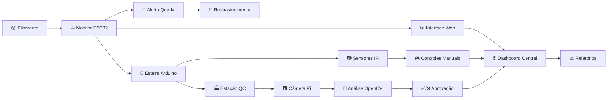

# 🎯 3dPot - Monitor de Filamento & Automação para Impressão 3D

[](https://github.com/dronreef2/3dPot/actions/workflows/ci.yml)
[](https://github.com/dronreef2/3dPot/actions)
[](https://github.com/dronreef2/3dPot/actions)
[](https://github.com/dronreef2/3dPot/actions)
[](https://github.com/dronreef2/3dPot/actions)
[](https://opensource.org/licenses/MIT)
[](https://www.python.org/downloads/)
[](https://www.arduino.cc/)
[](https://openscad.org/)
[](https://github.com/dronreef2/3dPot/graphs/commit-activity)
[](https://github.com/dronreef2/3dPot/issues)
[](https://github.com/dronreef2/3dPot/issues?q=is%3Aissue+is%3Aclosed)

**Projetos práticos que combinam hardware de baixo custo com impressão 3D para criar soluções inteligentes e acessíveis.**

## Visão Geral

A combinação de hardware de baixo custo com impressão 3D e software open-source cria um ecossistema poderoso para transformar ideias digitais em objetos físicos inteligentes.

## 📁 Estrutura do Repositório

### 🏗️ **Organização Visual**
```
3dPot/
├── 📄 README.md                    # Documentação principal
├── 🧪 tests/                       # Sistema de testes (pytest)
│   ├── unit/                       # Testes unitários
│   │   ├── test_project_structure.py
│   │   ├── test_3d_models.py
│   │   ├── test_arduino/
│   │   ├── test_esp32/
│   │   └── test_raspberry_pi/
│   ├── integration/                # Testes de integração
│   │   └── test_system_integration.py
│   ├── requirements-test.txt       # Dependências de teste
│   └── pytest.ini                 # Configuração pytest
├── 📂 projetos/                    # Projetos completos
│   ├── esp32/monitor-filamento/    # Monitor de filamento
│   ├── arduino/esteira-transportadora/  # EsteTransportadora
│   ├── raspberry-pi/estacao-qc/    # Estação QC
│   └── toolchain/                  # Ferramentas auxiliares
├── 💻 codigos/                     # Código fonte organizado
│   ├── esp32/                      # Firmware ESP32
│   ├── arduino/                    # Sketch Arduino
│   └── raspberry-pi/               # Scripts Python
├── 🎯 modelos-3d/                  # Modelos OpenSCAD
│   ├── esp32-projetos/             # Suportes ESP32
│   ├── arduino-projetos/           # Componentes esteira
│   └── raspberry-pi-projetos/      # Cases e suportes
├── 🖼️ assets/screenshots/          # Galeria visual completa
│   ├── GALERIA-VISUAL.md           # Índice da galeria
│   ├── GUIA-CONEXOES.md            # Guia técnico detalhado
│   ├── arquitetura-*.png           # Diagramas de arquitetura
│   ├── esquematico-*.png           # Esquemáticos técnicos
│   ├── mockup-fisico-*.png         # Visualizações montadas
│   └── interface-*.png             # Mockups de interface
└── 🚀 .github/workflows/           # CI/CD Pipeline
    ├── ci.yml                      # Pipeline principal
    ├── openscad.yml                # Validação modelos 3D
    ├── arduino-build.yml           # Build Arduino/ESP32
    └── python-tests.yml            # Testes Python
```

### 🧪 **Sistema de Testes (pytest)**
O projeto inclui um **sistema completo de testes** para garantir qualidade:

```bash
# Executar todos os testes
./run_tests.sh

# Testes unitários
python -m pytest tests/unit/ -v

# Testes com coverage
python -m pytest --cov=codigos/ tests/

# Testes específicos por projeto
python -m pytest tests/unit/test_esp32/ -v
```

**Testes Disponíveis:**
- ✅ **Estrutura do projeto** - Validação de diretórios e arquivos
- ✅ **Modelos 3D** - Verificação OpenSCAD e organização  
- ✅ **Integração** - Comunicação entre hardware/software
- ✅ **Qualidade** - Coverage e validação de código

### 📋 **Checklist de Arquivos Essenciais**
Para cada projeto implementado, certifique-se de ter:
- [ ] `README.md` específico do projeto
- [ ] Código fonte na pasta `codigos/`
- [ ] Modelos 3D na pasta `modelos-3d/`
- [ ] Esquemáticos em `assets/screenshots/`
- [ ] Testes unitários em `tests/unit/`
- [ ] Documentação visual atualizada

## 🖼️ Galeria Visual

Abaixo você encontra diagramas técnicos, mockups de interface, mockups físicos dos projetos montados e visualizações dos projetos. Para uma galeria completa com descrições detalhadas, acesse: [`assets/screenshots/GALERIA-VISUAL.md`](assets/screenshots/GALERIA-VISUAL.md)

**🆕 NOVOS MOCKUPS FÍSICOS ADICIONADOS:**
- 📷 Visualizações realistas dos projetos montados com modelos 3D impressos
- 🎬 Demonstrações visuais das funcionalidades em ação
- 🔧 Guias visuais de montagem e integração
- 📊 Interfaces web com dados em tempo real

### 🏗️ Arquitetura dos Sistemas

#### **Monitor de Filamento ESP32**

*Sistema completo de monitoramento com ESP32, interface web e integração IoT*

#### **Esteira Transportadora Arduino**

*Controle de motores, sensores e interface de usuário para automação*

#### **Estação QC Raspberry Pi**

*Sistema de visão computacional para controle de qualidade automatizado*

### 🔄 Integração do Ecossistema

#### **Fluxo 3dPot**

*Como os três projetos se integram em um ecossistema de produção inteligente*

### 🖥️ Interfaces Web

#### **Interface Monitor ESP32**

*Dashboard responsivo para monitoramento de filamento em tempo real*

#### **Dashboard Estação QC**

*Interface web para análise automática de qualidade com galeria de fotos*

### 🎯 Modelos 3D Técnicos

#### **Especificações dos Modelos 3D**

*Especificações detalhadas dos modelos OpenSCAD paramétricos*

### 🔌 Esquemáticos Técnicos

#### **Monitor ESP32**

*Diagrama detalhado de conexões: ESP32, HX711, células de carga*

#### **Esteira Arduino**

*Esquemático completo: Arduino, motor NEMA17, sensores, controles*

#### **Estação QC**

*Diagrama de conexões: Raspberry Pi, câmera, LED ring, motor*

#### **Sistema Integrado**

*Integração global: rede WiFi, MQTT, fluxo de produção*

### 🌊 **Fluxo Visual Completo do Sistema**

#### **Como os Projetos Trabalham Juntos**

*Fluxo integrado: Monitor → Transporte → QC → Produção Final*

#### **Demonstração das Interfaces em Ação**

*Interfaces web funcionando com dados reais em tempo real*

#### **Processo de Montagem dos Modelos 3D**

*Do arquivo OpenSCAD ao projeto funcionando: impressão → montagem → integração*

### 🔄 **Ciclo Completo de Produção**



**Benefícios do Ecossistema Integrado:**
- 🔍 **Monitoramento automático** do filamento
- 🚀 **Transporte inteligente** entre estações
- 🏭 **Controle de qualidade** com IA
- 📊 **Dashboard central** com todos os dados
- 🚨 **Alertas proativos** para manutenção
- 📈 **Relatórios de produção** automáticos

📖 **Para instruções detalhadas de montagem, consulte**: [`assets/screenshots/GUIA-CONEXOES.md`](assets/screenshots/GUIA-CONEXOES.md)

---

## 🚀 Quick Start - Guia Visual para Iniciantes

### 📋 Resumo do Sistema


O **3dPot** é um ecossistema completo que integra **3 projetos inteligentes** para automação de impressão 3D:

| Projeto | Hardware | Função | Dificuldade |
|---------|----------|--------|-------------|
| 🔍 **Monitor de Filamento** | ESP32 | Pesagem e monitoramento do filamento | ⭐ Fácil |
| 🚀 **Esteira Transportadora** | Arduino | Transporte automático de peças | ⭐⭐ Intermediário |
| 🏭 **Estação QC** | Raspberry Pi | Controle de qualidade com visão | ⭐⭐⭐ Avançado |

### 🎯 Como Começar (5 Minutos)

#### 1️⃣ **Clone e Instale** (2 min)
```bash
# Clone o repositório
git clone https://github.com/dronreef2/3dPot.git
cd 3dPot

# Instale dependências Python
pip install -r requirements-test.txt

# Execute os testes básicos
python -m pytest tests/unit/test_project_structure.py -v
```

#### 2️⃣ **Escolha um Projeto** (1 min)
- 👶 **Primeiro projeto**: Monitor de Filamento ESP32 (mais simples)
- 🛠️ **Segundo projeto**: Esteira Transportadora Arduino (intermediário)
- 🏆 **Desafio**: Estação QC Raspberry Pi (avançado)

#### 3️⃣ **Acesse os Recursos** (2 min)
- 📖 [Guia Completo de Conexões](assets/screenshots/GUIA-CONEXOES.md)
- 🖼️ [Galeria Visual Completa](assets/screenshots/GALERIA-VISUAL.md)
- 💻 [Código de Exemplo](codigos/)

---

## 🔧 Instalação Detalhada por Projeto

### 🟢 Projeto 1: Monitor de Filamento ESP32 (Recomendado para iniciantes)


#### 📦 **Lista de Compras**
- ESP32 DevKit V1
- Sensor HX711 + 4x células de carga
- Protoboard + jumpers
- LED + resistor 220Ω
- Carretel de filamento para teste

#### 🔌 **Conexões (Super Simples!)**


```
ESP32    →    HX711
GPIO 4   →    DOUT
GPIO 5   →    SCK
3.3V     →    VCC
GND      →    GND
GPIO 2   →    LED (+ resistor 220Ω)
```

#### 💻 **Upload do Código**
```bash
# Via Arduino IDE
1. Instale ESP32 board no Arduino IDE
2. Abra: codigos/esp32/monitor-filamento.ino
3. Selecione: ESP32 Dev Module
4. Upload!

# Via PlatformIO (Recomendado)
pio device monitoring
```

#### 🌐 **Acesse a Interface**
```
http://IP_DO_ESP32.local
```
**Dica**: O ESP32 cria automaticamente uma rede WiFi "3dPot-XXX" se não encontrar sua rede!

---

### 🟠 Projeto 2: EsteTransportadora Arduino


#### 📦 **Lista de Compras**
- Arduino Uno ou Nano
- Motor NEMA17 + Driver A4988
- 2x Sensores IR
- Display LCD 16x2
- Fonte 12V 2A
- Resistores diversos

#### 🔌 **Conexões Intermediárias**


#### 💻 **Código e Teste**
```bash
# Arduino IDE
1. Abra: codigos/arduino/esteira-transportadora.ino
2. Selecione: Arduino Uno
3. Upload + Monitor Serial (115200 baud)
```

#### 🎮 **Controles Disponíveis**
- Potenciômetro: Velocidade da esteira
- Botão: Parar/emergência
- Monitor Serial: Comandos de controle

---

### 🔴 Projeto 3: Estação QC Raspberry Pi


#### 📦 **Lista de Compras**
- Raspberry Pi 4 (2GB+)
- Câmera Pi HQ
- LED Ring 12V
- Motor NEMA17 + Driver
- Fonte 12V 5A + 5V 3A

#### 🐍 **Setup do Software**
```bash
# No Raspberry Pi
sudo raspi-config  # Habilite Câmera e I2C
sudo pip install opencv-python RPi.GPIO paho-mqtt

# Clone e execute
cd 3dPot
python codigos/raspberry-pi/estacao_qc.py
```

#### 🌐 **Dashboard Web**
```
http://IP_DO_PI:5000
```
**Recursos**: Análise automática, galeria de fotos, relatórios

---

## 🔍 Troubleshooting Comum

### 🚨 **Problemas de Hardware**

| Problema | Causa Provável | Solução |
|----------|----------------|---------|
| 🔌 ESP32 não liga | Alimentação USB | Use cabo dados + carga (não só carga) |
| ⚖️ Célula de carga instável | Vibração/ruído | Monte em superfície estável, cables curtos |
| 🚀 Motor pulando passos | Alimentação fraca | Verifique 12V 2A, reduce velocidade |
| 📷 Câmera Pi negra | Interface desabilitada | `sudo raspi-config` → Interface → Camera |

### 🌐 **Problemas de Conectividade**

| Problema | Diagnóstico | Solução |
|----------|-------------|---------|
| 📶 ESP32 sem WiFi | LED não pisca | Verifique SSID/senha no código |
| 🔌 Arduino mudo | Monitor serial vazio | Check 115200 baud, reset button |
| 🖥️ Pi dashboard offline | 404/connection refused | `ps aux \| grep python` para verificar se está rodando |

### 💻 **Problemas de Software**

```bash
# Python errors
pip install --upgrade -r requirements-test.txt

# Arduino libraries
# Use Library Manager para:
# - WiFi (ESP32)
# - LiquidCrystal (LCD)
# - AccelStepper (motores)

# OpenSCAD models
openscad -o output.stl model.scad
```

### 🔧 **Comandos de Diagnóstico Úteis**

```bash
# ESP32
pio device list                    # Lista dispositivos
pio device monitoring             # Monitor serial

# Arduino
ls /dev/tty*                      # Lista portas USB
screen /dev/ttyUSB0 115200       # Monitor serial manual

# Raspberry Pi
vcgencmd get_camera              # Status da câmera
lsmod | grep i2c                 # Módulos I2C carregados
systemctl status mosquitto       # MQTT broker status
```

### 📞 **Precisa de Mais Ajuda?**

1. 🐛 **Issues**: [Abra uma issue](https://github.com/dronreef2/3dPot/issues) com fotos do problema
2. 💬 **Discussions**: [Participe das discussões](https://github.com/dronreef2/3dPot/discussions)
3. 📧 **Email**: Para problemas complexos, inclua logs e especificações do hardware

## 📚 Recursos Adicionais

### 🗂️ **Documentação Técnica**
| Recurso | Descrição | Nível |
|---------|-----------|-------|
| 🔌 [Guia de Conexões](assets/screenshots/GUIA-CONEXOES.md) | Diagramas esquemáticos detalhados | ⭐⭐ |
| 🖼️ [Galeria Visual](assets/screenshots/GALERIA-VISUAL.md) | Mockups, interfaces e diagramas | ⭐ |
| 🏗️ [Arquiteturas do Sistema](assets/screenshots/) | Diagramas técnicos de cada projeto | ⭐⭐ |
| 🎯 [Especificações 3D](assets/screenshots/modelos-3d-especificacoes.png) | Modelos OpenSCAD paramétricos | ⭐⭐ |

### 🛠️ **Ferramentas e Setup**
| Ferramenta | Uso | Link |
|------------|-----|------|
| Arduino IDE | Programação ESP32/Arduino | [Download](https://www.arduino.cc/en/software) |
| PlatformIO | Desenvolvimento profissional | [VSCode Extension](https://marketplace.visualstudio.com/items?itemName=platformio.platformio-ide) |
| OpenSCAD | Modelagem 3D paramétrica | [Download](https://openscad.org/downloads.html) |
| KiCad | Design de PCBs | [Download](https://www.kicad.org/download/) |

### 📖 **Guias de Aprendizado**
- 🎓 **Iniciantes**: Comece com Monitor ESP32, leitura da galeria visual
- 🔧 **Intermediários**: Esteira Arduino, explore PlatformIO
- 🏆 **Avançados**: Estação QC, integração MQTT, dashboards
- 🌐 **IoT**: Protocolos, Home Assistant, automação residencial

### 🤝 **Comunidade e Contribuição**
- 🐛 [Issues e Bugs](https://github.com/dronreef2/3dPot/issues) - Reporte problemas
- 💡 [Feature Requests](https://github.com/dronreef2/3dPot/discussions) - Sugira melhorias
- 🤝 [Contribuições](CONTRIBUTING.md) - Como ajudar o projeto
- 📋 [Código de Conduta](CODE_OF_CONDUCT.md) - Diretrizes da comunidade

### 🎯 **Próximos Passos**

Após configurar seu primeiro projeto:

1. 📈 **Implemente os outros projetos** seguindo a ordem de dificuldade
2. 🔗 **Integre o ecossistema** usando MQTT para comunicação
3. 🏠 **Conecte ao Home Assistant** para automação residencial
4. 📊 **Crie dashboards customizados** com os dados coletados
5. 🤝 **Compartilhe suas modificações** com a comunidade

### ⚡ **Dicas de Produtividade**

- **Use PlatformIO** ao invés da Arduino IDE para projetos mais complexos
- **Imprima os modelos 3D** com configurações de alta qualidade (0.2mm layer height)
- **Teste cada componente** individualmente antes da integração completa
- **Mantenha backup** das configurações que funcionam
- **Documente suas modificações** para facilitar troubleshooting

---

### 🆘 **Suporte da Comunidade**

- 🐛 **Issues**: [Reportar bugs](https://github.com/dronreef2/3dPot/issues) com fotos e logs
- 💬 **Discussões**: [Perguntas e ideias](https://github.com/dronreef2/3dPot/discussions)  
- 🔧 **Wiki**: [Documentação expandida](https://github.com/dronreef2/3dPot/wiki) (em desenvolvimento)
- 📧 **Email**: Para problemas complexos, inclua especificações completas do hardware

---

## 📖 Parte 1: Insights de Projetos (Hardware + Impressão 3D)

Projetos que exploram a sinergia única entre cada hardware e a impressão 3D.

### Projetos com ESP32 / ESP8266 (Os "Objetos Inteligentes")

O forte deles é serem pequenos, baratos e com Wi-Fi. A impressão 3D permite **embutir a inteligência** diretamente no objeto, tornando-o funcional e com bom acabamento.

#### Insight 1: O Gabarito de Montagem Auto-Verificável

**Ideia:** Em uma pequena linha de montagem (até mesmo em uma bancada de hobby), você precisa garantir que cada peça seja montada corretamente.

**Execução:**
1. **Modelagem 3D:** Projete e imprima um gabarito (jig) perfeitamente moldado para a peça que você está montando. Incorpore no design pequenos espaços para sensores de contato (microswitches) ou sensores ópticos reflexivos.
2. **Hardware:** Embuta um ESP8266 no gabarito. Conecte os sensores a ele.
3. **Programação:** O ESP8266 só envia um sinal de "OK" (via MQTT ou para um painel web) quando todos os componentes da montagem são colocados no gabarito e ativam os sensores na ordem correta. Um LED no próprio gabarito fica verde.

**Por que é genial:** Você cria uma ferramenta de controle de qualidade sob demanda, customizada e inteligente por menos de 10 dólares.

#### Insight 2: O Monitor de Filamento "Universal"

**Ideia:** Saber quanto filamento resta em qualquer carretel, de qualquer marca.

**Execução:**
1. **Modelagem 3D:** Projete um suporte de carretel com um braço de alavanca. O peso do carretel pressiona uma célula de carga (sensor de peso).
2. **Hardware:** Conecte a célula de carga a um ESP32.
3. **Programação:** O ESP32 mede o peso, subtrai o peso do carretel vazio (que você informa uma vez) e calcula a porcentagem restante. Ele expõe essa informação em uma pequena página web ou envia para uma plataforma como o Home Assistant.

**Por que é genial:** É uma solução barata e adaptável a qualquer impressora 3D, resolvendo um problema comum e permitindo um melhor planejamento de impressões longas.

### Projetos com Arduino (O "Controlador Físico")

O Arduino brilha no controle preciso de motores e na interação direta com o mundo físico. A impressão 3D fornece a **estrutura mecânica e os atuadores** para esses projetos.

#### Insight 1: A Mini Esteira Transportadora Modular

**Ideia:** Criar uma pequena esteira para automatizar tarefas, como mover peças de uma etapa para outra.

**Execução:**
1. **Modelagem 3D:** Projete todos os componentes: os roletes, a estrutura lateral, os suportes para os motores e sensores. A beleza aqui é que você pode imprimir módulos e encaixá-los para fazer a esteira do tamanho que quiser.
2. **Hardware:** Um Arduino Uno controla um motor de passo (para movimento preciso) ou um motor DC com encoder. Sensores infravermelhos detectam quando um objeto chega ao fim da esteira.
3. **Programação:** O Arduino gerencia a velocidade da esteira e para o motor quando um objeto é detectado, podendo acionar outro dispositivo (como um braço robótico).

**Por que é genial:** Você constrói a base da automação industrial (movimentação de material) de forma barata e totalmente customizável para o seu espaço e necessidade.

#### Insight 2: O "Liquid Handler" para Projetos de Biologia/Química DIY

**Ideia:** Automatizar a tarefa de mover pequenas quantidades de líquido entre recipientes.

**Execução:**
1. **Modelagem 3D:** Projete um sistema de 3 eixos (X, Y, Z) usando guias lineares baratas e correias. Todas as conexões, suportes de motor e o "efetor final" que segura uma pipeta são impressos em 3D.
2. **Hardware:** Um Arduino Mega com um shield (como o RAMPS) controla 3 motores de passo para o posicionamento e um servo motor para acionar a pipeta.
3. **Programação:** O código no Arduino aceita comandos G-code simples (como em uma impressora 3D) para mover a pipeta para coordenadas específicas e aspirar/dispensar volumes definidos.

**Por que é genial:** Democratiza a automação de laboratório, permitindo a criação de ferramentas que normalmente custariam milhares de reais.

### Projetos com Raspberry Pi (O "Cérebro Central")

O Raspberry Pi é um computador completo. Ele não apenas controla, mas **orquestra, processa e serve** informações. A impressão 3D cria os "olhos e ouvidos" que alimentam o cérebro do Pi.

#### Insight: A Estação de Controle de Qualidade com Visão Computacional

**Ideia:** Inspecionar automaticamente peças recém-impressas para detectar defeitos grosseiros.

**Execução:**
1. **Modelagem 3D:** Projete uma pequena "cabine" de inspeção com iluminação LED controlada e um suporte fixo para a Câmera do Raspberry Pi, garantindo fotos consistentes. Projete também um prato giratório (acionado por um motor de passo).
2. **Hardware:** Um Raspberry Pi controla a iluminação, a câmera e o motor do prato giratório. Um Arduino pode ser usado como um "escravo" para controlar o motor com mais precisão, recebendo comandos do Pi.
3. **Programação (Python no Pi):**
   - O Pi aciona o motor para girar a peça 360 graus, tirando várias fotos.
   - Usa a biblioteca **OpenCV** para comparar as fotos tiradas com uma imagem de referência do modelo 3D renderizado.
   - Ele pode identificar defeitos como camadas faltando, deformações graves (warping) ou falhas de impressão.
   - O resultado (Aprovado/Reprovado) é exibido em um dashboard web servido pelo próprio Pi.

**Por que é genial:** Cria um sistema de "loop fechado", onde a própria tecnologia de fabricação é usada para criar uma ferramenta que melhora sua própria qualidade, integrando robótica, visão computacional e web.

## Parte 2: O Toolchain Open-Source (O Ciclo Completo: da Ideia ao Objeto Inteligente)

Este é o fluxo de trabalho de software que conecta tudo.

### 1. Modelagem 3D (Onde a forma física nasce)

- **Para Iniciantes / Simples: [Tinkercad](https://www.tinkercad.com/)**
  - Baseado em navegador, incrivelmente fácil de aprender. Ótimo para caixas, suportes e formas geométricas simples.
- **Para Engenharia / Paramétrico: [FreeCAD](https://www.freecadweb.org/) ou [Onshape](https://www.onshape.com/) (gratuito para makers)**
  - Permitem criar modelos complexos e "paramétricos" (você pode mudar uma medida e o modelo todo se ajusta). Essencial para projetos mecânicos.
- **Para Modelagem via Código: [OpenSCAD](https://openscad.org/)**
  - **Este é o link direto com a programação!** Você não desenha, você *descreve* o objeto com código. Perfeito para criar peças customizáveis, onde você só precisa alterar variáveis em um script para gerar um novo STL.

### 2. Fatiamento (Preparando o modelo para a impressão)

- **[Ultimaker Cura](https://ultimaker.com/software/ultimaker-cura)** ou **[PrusaSlicer](https://www.prusa3d.com/page/prusaslicer_424/)**
  - Ambos são open-source, poderosos e compatíveis com quase todas as impressoras. Eles "fatiam" o modelo 3D em camadas e geram o G-code (as instruções que a impressora entende).

### 3. Programação do Hardware (Dando vida ao objeto)

- **[PlatformIO](https://platformio.org/)** (integrado ao **[Visual Studio Code](https://code.visualstudio.com/)** - VSCode)
  - **É o padrão ouro para desenvolvimento embarcado hoje.** É um ambiente profissional que suporta Arduino, ESP32, ESP8266 e centenas de outras placas. Gerencia bibliotecas e configurações de forma muito mais robusta que a IDE do Arduino.
  - Você pode programar em C++ (framework Arduino) ou usar **MicroPython** para os ESPs.
- **Python no Raspberry Pi**
  - Use um editor como o VSCode com a extensão Remote-SSH para programar o Pi diretamente do seu computador. Bibliotecas essenciais: `gpiozero` (fácil controle dos pinos), `paho-mqtt` (para comunicação IoT), `opencv-python` (para visão computacional), `Flask` ou `FastAPI` (para criar interfaces web).

### 4. Integração e Orquestração (Fazendo tudo conversar)

- **[Node-RED](https://nodered.org/)**
  - Roda perfeitamente em um Raspberry Pi. É a "cola" visual que une todos os seus projetos. Você pode, por exemplo, arrastar e soltar nós para criar um fluxo que:
    1. Recebe uma mensagem **MQTT** de um ESP32.
    2. Executa um script **Python** no Raspberry Pi.
    3. Envia um comando para uma API (como a da Factory AI).
    4. Mostra o status em um **dashboard** web.
- **[Mosquitto](https://mosquitto.org/)**
  - Um broker MQTT leve que você pode instalar no seu Raspberry Pi para ser o "servidor de mensagens" central para todos os seus dispositivos IoT na sua rede local.

## Licença

Este projeto é open-source e está disponível sob a licença MIT.

## Como Contribuir

1. Faça um fork do projeto
2. Crie uma branch para sua feature (`git checkout -b feature/AmazingFeature`)
3. Commit suas mudanças (`git commit -m 'Add some AmazingFeature'`)
4. Push para a branch (`git push origin feature/AmazingFeature`)
5. Abra um Pull Request

## Autor

Guilherme  dronreef2- Análise e documentação de projetos Maker
