# 3D Pot - Projetos Maker com Hardware e Impressão 3D

[](https://opensource.org/licenses/MIT)
[](https://www.python.org/downloads/)
[](https://github.com/dronreef2/3dPot)
[](https://github.com/dronreef2/3dPot/graphs/commit-activity)
[](https://github.com/dronreef2/3dPot/issues)
[](https://github.com/dronreef2/3dPot/issues?q=is%3Aissue+is%3Aclosed)

**Projetos práticos que combinam hardware de baixo custo com impressão 3D para criar soluções inteligentes e acessíveis.**

## Visão Geral

A combinação de hardware de baixo custo com impressão 3D e software open-source cria um ecossistema poderoso para transformar ideias digitais em objetos físicos inteligentes.

## Estrutura do Repositório

```
3dPot/
├── README.md
├── projetos/
│   ├── esp32/
│   ├── arduino/
│   ├── raspberry-pi/
│   └── toolchain/
├── codigos/
│   ├── esp32/
│   ├── arduino/
│   └── raspberry-pi/
└── modelos-3d/
    ├── esp32-projetos/
    ├── arduino-projetos/
    └── raspberry-pi-projetos/
```

## 🖼️ Galeria Visual

Abaixo você encontra diagramas técnicos, mockups de interface e visualizações dos projetos. Para uma galeria completa com descrições detalhadas, acesse: [`assets/screenshots/GALERIA-VISUAL.md`](assets/screenshots/GALERIA-VISUAL.md)

### 🏗️ Arquitetura dos Sistemas

#### **Monitor de Filamento ESP32**
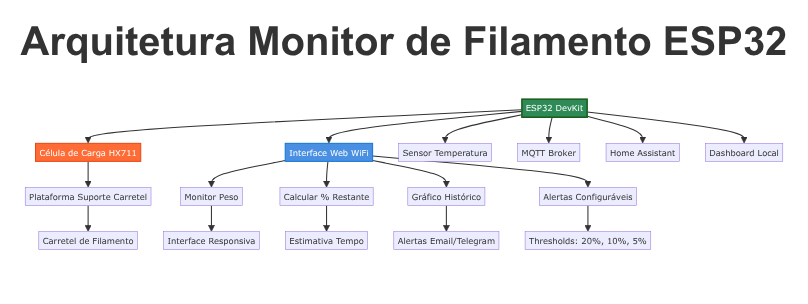
*Sistema completo de monitoramento com ESP32, interface web e integração IoT*

#### **Esteira Transportadora Arduino**
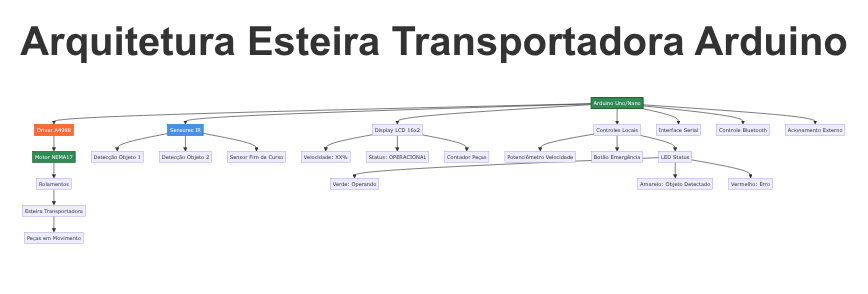
*Controle de motores, sensores e interface de usuário para automação*

#### **Estação QC Raspberry Pi**
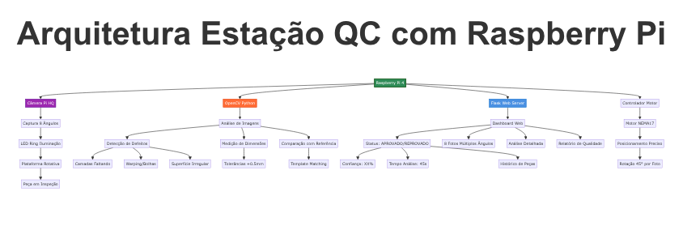
*Sistema de visão computacional para controle de qualidade automatizado*

### 🔄 Integração do Ecossistema

#### **Fluxo 3dPot**
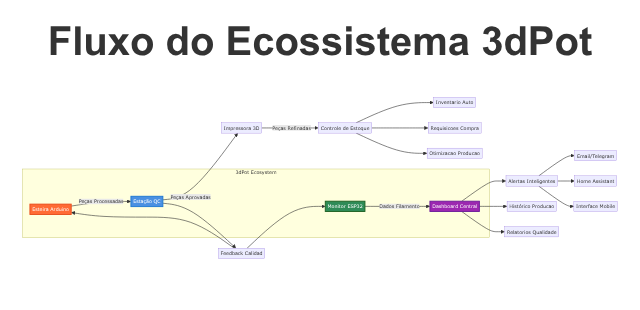
*Como os três projetos se integram em um ecossistema de produção inteligente*

### 🖥️ Interfaces Web

#### **Interface Monitor ESP32**
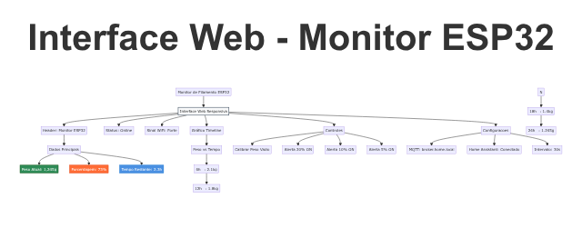
*Dashboard responsivo para monitoramento de filamento em tempo real*

#### **Dashboard Estação QC**
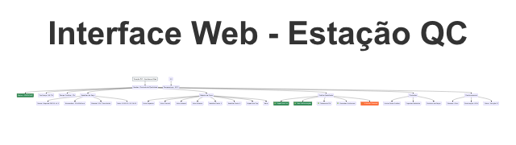
*Interface web para análise automática de qualidade com galeria de fotos*

### 🎯 Modelos 3D Técnicos

#### **Especificações dos Modelos 3D**
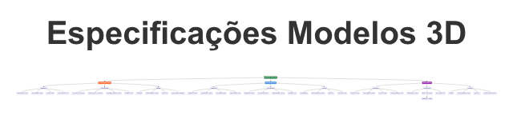
*Especificações detalhadas dos modelos OpenSCAD paramétricos*

### 🔌 Esquemáticos Técnicos

#### **Monitor ESP32**
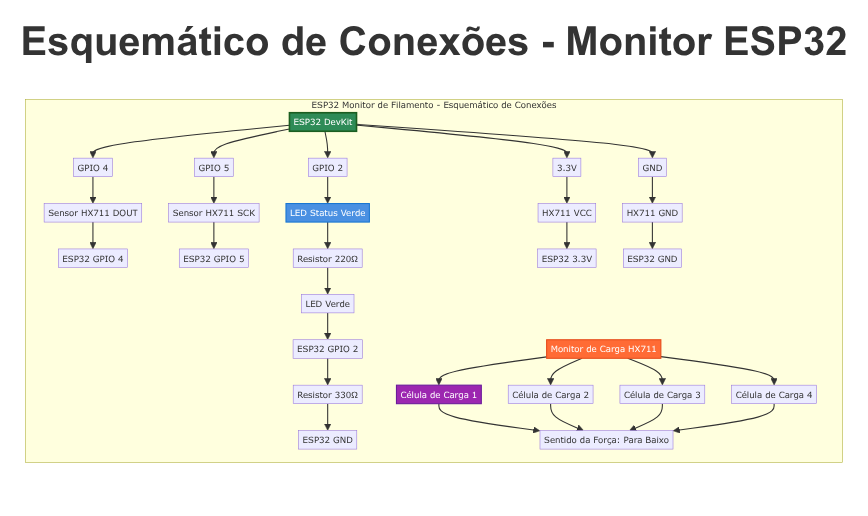
*Diagrama detalhado de conexões: ESP32, HX711, células de carga*

#### **Esteira Arduino**
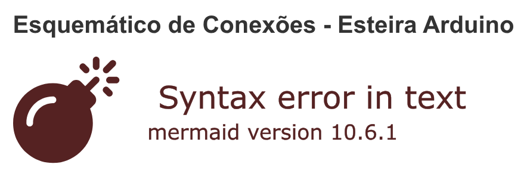
*Esquemático completo: Arduino, motor NEMA17, sensores, controles*

#### **Estação QC**
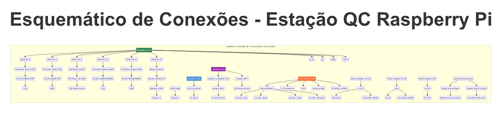
*Diagrama de conexões: Raspberry Pi, câmera, LED ring, motor*

#### **Sistema Integrado**
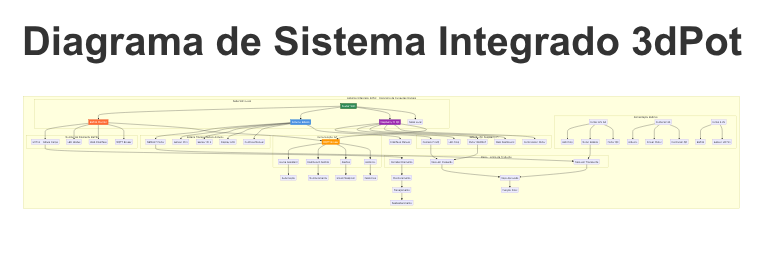
*Integração global: rede WiFi, MQTT, fluxo de produção*

📖 **Para instruções detalhadas de montagem, consulte**: [`assets/screenshots/GUIA-CONEXOES.md`](assets/screenshots/GUIA-CONEXOES.md)

---

## 🚀 Primeiros Passos

### Pré-requisitos

Antes de começar, certifique-se de ter o seguinte:

#### Hardware Básico
- **Para ESP32**: ESP32 DevKit, célula de carga HX711, carretel de filamento
- **Para Arduino**: Arduino Uno/Nano, motor de passo NEMA17, sensores IR
- **Para Raspberry Pi**: Raspberry Pi 4, câmera Pi, display (opcional)

#### Software Necessário
- **Arduino IDE** ou **PlatformIO** (para ESP32/Arduino)
- **Python 3.8+** (para Raspberry Pi)
- **OpenSCAD** ou **Tinkercad** (para modelos 3D)
- **Git** (para controle de versão)

### 🔧 Instalação Rápida

1. **Clone este repositório:**
   ```bash
   git clone https://github.com/dronreef2/3dPot.git
   cd 3dPot
   ```

2. **Execute o script de instalação:**
   ```bash
   chmod +x setup-3dpot.sh
   ./setup-3dpot.sh
   ```

3. **Escolha seu projeto:**
   - **Monitor de Filamento (ESP32)**: `projetos/esp32/monitor-filamento/`
   - **Esteira Transportadora (Arduino)**: `projetos/arduino/esteira-modular/`
   - **Estação QC (Raspberry Pi)**: `projetos/raspberry-pi/estacao-qc-visao/`

### 📁 Estrutura dos Projetos

Cada projeto segue esta estrutura padrão:
```
projeto/
├── README.md              # Documentação específica
├── hardware/              # Esquemáticos e PCBs
├── modelos-3d/            # Arquivos .scad e .stl
├── firmware/              # Código para microcontroladores
├── software/              # Código para computadores
└── docs/                  # Guias detalhados
```

### 🛠️ Guias de Desenvolvimento

#### Projeto ESP32 - Monitor de Filamento
1. **Hardware**: Monte a célula de carga conforme o esquemático
2. **3D**: Imprime o `suporte-filamento.scad` (ajuste diâmetros conforme necessário)
3. **Firmware**: Carregue `monitor-filamento.ino` via Arduino IDE
4. **Teste**: Acesse `http://IP_ESP32.local` para interface web

#### Projeto Arduino - Esteira Transportadora
1. **Hardware**: Monte o motor de passo e sensores IR
2. **3D**: Imprime os componentes da `esteira-transportadora.ino`
3. **Firmware**: Carregue o código via Arduino IDE
4. **Teste**: Use o monitor serial para controlar velocidades

#### Projeto Raspberry Pi - Estação QC
1. **Setup**: Instale OpenCV e dependências Python
2. **3D**: Imprime o suporte da câmera
3. **Software**: Execute `estacao_qc.py`
4. **Teste**: Acesse `http://IP_PI:5000` para interface web

### 🔍 Troubleshooting Comum

#### Problemas de Conectividade
- **ESP32 não conecta ao WiFi**: Verifique SSID e senha no código
- **Arduino não responde**: Teste com monitor serial a 115200 baud
- **Raspberry Pi câmera**: Habilite via `raspi-config`

#### Problemas de Hardware
- **Célula de carga instável**: Verifique conexões e isolação
- **Motor de passo sem força**: Cheque alimentação (12V para NEMA17)
- **CâmeraPi não detecta**: Teste com `vcgencmd get_camera`

#### Problemas de Software
- **Python import errors**: Execute `pip install -r requirements.txt`
- **Arduino library missing**: Instale via Library Manager
- **OpenSCAD rendering**: Verifique syntax nos arquivos .scad

### 📚 Recursos Adicionais

- [Guia de Instalação Completo](projetos/toolchain/guia-instalacao.md)
- [Template de Dashboard](projetos/toolchain/template-dashboard.html)
- [Contribuindo para o Projeto](CONTRIBUTING.md)
- [Código de Conduta](CODE_OF_CONDUCT.md)

### 🆘 Precisa de Ajuda?

1. **Issues**: [Abra uma issue](https://github.com/dronreef2/3dPot/issues)
2. **Discussions**: [Participe das discussões](https://github.com/dronreef2/3dPot/discussions)
3. **Comunidade**: Junte-se ao nosso Discord (link em breve)

---

## 📖 Parte 1: Insights de Projetos (Hardware + Impressão 3D)

Projetos que exploram a sinergia única entre cada hardware e a impressão 3D.

### Projetos com ESP32 / ESP8266 (Os "Objetos Inteligentes")

O forte deles é serem pequenos, baratos e com Wi-Fi. A impressão 3D permite **embutir a inteligência** diretamente no objeto, tornando-o funcional e com bom acabamento.

#### Insight 1: O Gabarito de Montagem Auto-Verificável

**Ideia:** Em uma pequena linha de montagem (até mesmo em uma bancada de hobby), você precisa garantir que cada peça seja montada corretamente.

**Execução:**
1. **Modelagem 3D:** Projete e imprima um gabarito (jig) perfeitamente moldado para a peça que você está montando. Incorpore no design pequenos espaços para sensores de contato (microswitches) ou sensores ópticos reflexivos.
2. **Hardware:** Embuta um ESP8266 no gabarito. Conecte os sensores a ele.
3. **Programação:** O ESP8266 só envia um sinal de "OK" (via MQTT ou para um painel web) quando todos os componentes da montagem são colocados no gabarito e ativam os sensores na ordem correta. Um LED no próprio gabarito fica verde.

**Por que é genial:** Você cria uma ferramenta de controle de qualidade sob demanda, customizada e inteligente por menos de 10 dólares.

#### Insight 2: O Monitor de Filamento "Universal"

**Ideia:** Saber quanto filamento resta em qualquer carretel, de qualquer marca.

**Execução:**
1. **Modelagem 3D:** Projete um suporte de carretel com um braço de alavanca. O peso do carretel pressiona uma célula de carga (sensor de peso).
2. **Hardware:** Conecte a célula de carga a um ESP32.
3. **Programação:** O ESP32 mede o peso, subtrai o peso do carretel vazio (que você informa uma vez) e calcula a porcentagem restante. Ele expõe essa informação em uma pequena página web ou envia para uma plataforma como o Home Assistant.

**Por que é genial:** É uma solução barata e adaptável a qualquer impressora 3D, resolvendo um problema comum e permitindo um melhor planejamento de impressões longas.

### Projetos com Arduino (O "Controlador Físico")

O Arduino brilha no controle preciso de motores e na interação direta com o mundo físico. A impressão 3D fornece a **estrutura mecânica e os atuadores** para esses projetos.

#### Insight 1: A Mini Esteira Transportadora Modular

**Ideia:** Criar uma pequena esteira para automatizar tarefas, como mover peças de uma etapa para outra.

**Execução:**
1. **Modelagem 3D:** Projete todos os componentes: os roletes, a estrutura lateral, os suportes para os motores e sensores. A beleza aqui é que você pode imprimir módulos e encaixá-los para fazer a esteira do tamanho que quiser.
2. **Hardware:** Um Arduino Uno controla um motor de passo (para movimento preciso) ou um motor DC com encoder. Sensores infravermelhos detectam quando um objeto chega ao fim da esteira.
3. **Programação:** O Arduino gerencia a velocidade da esteira e para o motor quando um objeto é detectado, podendo acionar outro dispositivo (como um braço robótico).

**Por que é genial:** Você constrói a base da automação industrial (movimentação de material) de forma barata e totalmente customizável para o seu espaço e necessidade.

#### Insight 2: O "Liquid Handler" para Projetos de Biologia/Química DIY

**Ideia:** Automatizar a tarefa de mover pequenas quantidades de líquido entre recipientes.

**Execução:**
1. **Modelagem 3D:** Projete um sistema de 3 eixos (X, Y, Z) usando guias lineares baratas e correias. Todas as conexões, suportes de motor e o "efetor final" que segura uma pipeta são impressos em 3D.
2. **Hardware:** Um Arduino Mega com um shield (como o RAMPS) controla 3 motores de passo para o posicionamento e um servo motor para acionar a pipeta.
3. **Programação:** O código no Arduino aceita comandos G-code simples (como em uma impressora 3D) para mover a pipeta para coordenadas específicas e aspirar/dispensar volumes definidos.

**Por que é genial:** Democratiza a automação de laboratório, permitindo a criação de ferramentas que normalmente custariam milhares de reais.

### Projetos com Raspberry Pi (O "Cérebro Central")

O Raspberry Pi é um computador completo. Ele não apenas controla, mas **orquestra, processa e serve** informações. A impressão 3D cria os "olhos e ouvidos" que alimentam o cérebro do Pi.

#### Insight: A Estação de Controle de Qualidade com Visão Computacional

**Ideia:** Inspecionar automaticamente peças recém-impressas para detectar defeitos grosseiros.

**Execução:**
1. **Modelagem 3D:** Projete uma pequena "cabine" de inspeção com iluminação LED controlada e um suporte fixo para a Câmera do Raspberry Pi, garantindo fotos consistentes. Projete também um prato giratório (acionado por um motor de passo).
2. **Hardware:** Um Raspberry Pi controla a iluminação, a câmera e o motor do prato giratório. Um Arduino pode ser usado como um "escravo" para controlar o motor com mais precisão, recebendo comandos do Pi.
3. **Programação (Python no Pi):**
   - O Pi aciona o motor para girar a peça 360 graus, tirando várias fotos.
   - Usa a biblioteca **OpenCV** para comparar as fotos tiradas com uma imagem de referência do modelo 3D renderizado.
   - Ele pode identificar defeitos como camadas faltando, deformações graves (warping) ou falhas de impressão.
   - O resultado (Aprovado/Reprovado) é exibido em um dashboard web servido pelo próprio Pi.

**Por que é genial:** Cria um sistema de "loop fechado", onde a própria tecnologia de fabricação é usada para criar uma ferramenta que melhora sua própria qualidade, integrando robótica, visão computacional e web.

## Parte 2: O Toolchain Open-Source (O Ciclo Completo: da Ideia ao Objeto Inteligente)

Este é o fluxo de trabalho de software que conecta tudo.

### 1. Modelagem 3D (Onde a forma física nasce)

- **Para Iniciantes / Simples: [Tinkercad](https://www.tinkercad.com/)**
  - Baseado em navegador, incrivelmente fácil de aprender. Ótimo para caixas, suportes e formas geométricas simples.
- **Para Engenharia / Paramétrico: [FreeCAD](https://www.freecadweb.org/) ou [Onshape](https://www.onshape.com/) (gratuito para makers)**
  - Permitem criar modelos complexos e "paramétricos" (você pode mudar uma medida e o modelo todo se ajusta). Essencial para projetos mecânicos.
- **Para Modelagem via Código: [OpenSCAD](https://openscad.org/)**
  - **Este é o link direto com a programação!** Você não desenha, você *descreve* o objeto com código. Perfeito para criar peças customizáveis, onde você só precisa alterar variáveis em um script para gerar um novo STL.

### 2. Fatiamento (Preparando o modelo para a impressão)

- **[Ultimaker Cura](https://ultimaker.com/software/ultimaker-cura)** ou **[PrusaSlicer](https://www.prusa3d.com/page/prusaslicer_424/)**
  - Ambos são open-source, poderosos e compatíveis com quase todas as impressoras. Eles "fatiam" o modelo 3D em camadas e geram o G-code (as instruções que a impressora entende).

### 3. Programação do Hardware (Dando vida ao objeto)

- **[PlatformIO](https://platformio.org/)** (integrado ao **[Visual Studio Code](https://code.visualstudio.com/)** - VSCode)
  - **É o padrão ouro para desenvolvimento embarcado hoje.** É um ambiente profissional que suporta Arduino, ESP32, ESP8266 e centenas de outras placas. Gerencia bibliotecas e configurações de forma muito mais robusta que a IDE do Arduino.
  - Você pode programar em C++ (framework Arduino) ou usar **MicroPython** para os ESPs.
- **Python no Raspberry Pi**
  - Use um editor como o VSCode com a extensão Remote-SSH para programar o Pi diretamente do seu computador. Bibliotecas essenciais: `gpiozero` (fácil controle dos pinos), `paho-mqtt` (para comunicação IoT), `opencv-python` (para visão computacional), `Flask` ou `FastAPI` (para criar interfaces web).

### 4. Integração e Orquestração (Fazendo tudo conversar)

- **[Node-RED](https://nodered.org/)**
  - Roda perfeitamente em um Raspberry Pi. É a "cola" visual que une todos os seus projetos. Você pode, por exemplo, arrastar e soltar nós para criar um fluxo que:
    1. Recebe uma mensagem **MQTT** de um ESP32.
    2. Executa um script **Python** no Raspberry Pi.
    3. Envia um comando para uma API (como a da Factory AI).
    4. Mostra o status em um **dashboard** web.
- **[Mosquitto](https://mosquitto.org/)**
  - Um broker MQTT leve que você pode instalar no seu Raspberry Pi para ser o "servidor de mensagens" central para todos os seus dispositivos IoT na sua rede local.

## Licença

Este projeto é open-source e está disponível sob a licença MIT.

## Como Contribuir

1. Faça um fork do projeto
2. Crie uma branch para sua feature (`git checkout -b feature/AmazingFeature`)
3. Commit suas mudanças (`git commit -m 'Add some AmazingFeature'`)
4. Push para a branch (`git push origin feature/AmazingFeature`)
5. Abra um Pull Request

## Autor

Guilherme  dronreef2- Análise e documentação de projetos Maker
