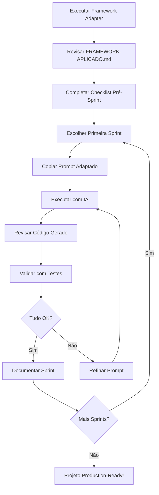

# Framework Adapter - Ferramenta de Aplicação do AI-Sprint Framework

Esta ferramenta permite que você aplique o **AI-Driven Sprint Framework** do projeto 3dPot a qualquer outro repositório, gerando automaticamente:

1. ✅ **Diagnóstico e Mapeamento** - Estima em qual estágio do framework seu projeto está
2. 🗺️ **Roadmap Personalizado** - Propõe 4-6 sprints customizadas para seu contexto
3. 🤖 **Prompts Adaptados** - 2-3 prompts prontos para usar com IA (GitHub Copilot, ChatGPT, Claude)
4. ✅ **Checklist Pré-Sprint** - Lista de verificação baseada no ENG-PLAYBOOK-IA.md

## 📋 Pré-requisitos

- Python 3.7+
- Conhecimento básico sobre seu repositório alvo

## 🚀 Como Usar

### Opção 1: Modo Interativo (Recomendado)

```bash
cd scripts/framework-adapter
python framework_adapter.py
```

O script irá guiá-lo através de perguntas interativas sobre seu repositório.

### Opção 2: Modo Linha de Comando

```bash
python framework_adapter.py \
  --repo-url "https://github.com/usuario/meu-projeto" \
  --stack "Python/FastAPI + PostgreSQL" \
  --objectives "API REST para gestão de inventário com integração a múltiplos fornecedores" \
  --test-coverage "~30%" \
  --observability "logs básicos com print()" \
  --security "JWT básico" \
  --documentation "mínima" \
  --output ./meu-projeto-output
```

### Parâmetros

| Parâmetro | Descrição | Exemplo |
|-----------|-----------|---------|
| `--repo-url` | URL do repositório alvo | `https://github.com/usuario/projeto` |
| `--stack` | Stack tecnológico principal | `Python/FastAPI`, `Node/Express`, `Java/Spring` |
| `--objectives` | Objetivo de alto nível do projeto | `"API REST para e-commerce"` |
| `--test-coverage` | Cobertura de testes aproximada | `"~40%"`, `"sem testes"`, `"desconhecida"` |
| `--observability` | Estado de observabilidade | `"nenhuma"`, `"logs básicos"`, `"avançada"` |
| `--security` | Estado de segurança | `"mínima"`, `"JWT básico"`, `"RBAC + MFA"` |
| `--documentation` | Estado de documentação | `"mínima"`, `"moderada"`, `"extensa"` |
| `--output` | Diretório de saída | `./output` (padrão: `./framework-output`) |

## 📦 Arquivos Gerados

Após a execução, os seguintes arquivos serão criados no diretório de saída:

```
framework-output/
├── FRAMEWORK-APLICADO.md          # Documento principal completo
└── prompts/
    ├── sprint-1-reorganização-e-estrutura.txt
    ├── sprint-2-testes-básicos-de-unidade.txt
    └── sprint-3-integração-+-cli.txt
```

### FRAMEWORK-APLICADO.md

Este é o documento principal que contém:

1. **Estágio Estimado** - Análise do estado atual do seu repositório
2. **Roadmap de Sprints** - 4-6 sprints recomendadas com prioridades
3. **Prompts Adaptados** - Prompts completos prontos para copiar e colar
4. **Checklist** - Verificação de pré-requisitos antes de começar

### prompts/

Diretório com arquivos de texto individuais contendo os prompts adaptados para as 2-3 sprints prioritárias.

## 📝 Exemplos de Uso

### Exemplo 1: Projeto Node.js sem Testes

```bash
python framework_adapter.py \
  --repo-url "https://github.com/empresa/api-produtos" \
  --stack "Node.js/Express + MongoDB" \
  --objectives "API REST para catálogo de produtos com busca e filtros" \
  --test-coverage "sem testes" \
  --observability "nenhuma" \
  --security "mínima" \
  --documentation "mínima"
```

**Resultado esperado:**
- Estágio estimado: Sprint 1-2
- Roadmap com 6 sprints: Estrutura → Testes Básicos → Integração → CI → Qualidade → Observabilidade

### Exemplo 2: Projeto Python com Testes Parciais

```bash
python framework_adapter.py \
  --repo-url "https://github.com/startup/ml-service" \
  --stack "Python/FastAPI + PostgreSQL" \
  --objectives "Serviço de ML para predição de churn" \
  --test-coverage "~60%" \
  --observability "logs básicos" \
  --security "JWT básico" \
  --documentation "moderada"
```

**Resultado esperado:**
- Estágio estimado: Sprint 2-3
- Roadmap com foco em: Completar Testes → Observabilidade → Segurança

### Exemplo 3: Projeto Java com Boa Base

```bash
python framework_adapter.py \
  --repo-url "https://github.com/corp/erp-service" \
  --stack "Java/Spring Boot + MySQL" \
  --objectives "Microserviço de gestão de estoque" \
  --test-coverage "~75%" \
  --observability "logs estruturados + métricas básicas" \
  --security "JWT + RBAC" \
  --documentation "extensa"
```

**Resultado esperado:**
- Estágio estimado: Sprint 5-6
- Roadmap com foco em: Observabilidade Avançada → Hardening → DR/MFA

## 🎯 Como Usar os Prompts Gerados

1. **Escolha sua IA preferida:**
   - GitHub Copilot Chat
   - ChatGPT (GPT-4 recomendado)
   - Claude
   - Outros assistentes de IA

2. **Abra o arquivo de prompt:**
   ```bash
   cat framework-output/prompts/sprint-1-reorganização-e-estrutura.txt
   ```

3. **Copie o conteúdo completo do prompt**

4. **Cole no chat da IA**

5. **Revise as sugestões** geradas pela IA

6. **Aplique as mudanças** incrementalmente, validando com testes

7. **Documente o resultado** da sprint

## 🔄 Workflow Recomendado



## 📚 Recursos Relacionados

- **AI-SPRINT-FRAMEWORK.md** - Framework completo das 9 sprints do 3dPot
- **AI-SPRINT-PROMPTS.md** - Templates de todos os prompts reutilizáveis
- **ENG-PLAYBOOK-IA.md** - Playbook de engenharia com IA e boas práticas

## 🤝 Contribuindo

Se você usar esta ferramenta e tiver sugestões de melhorias:

1. Documente seu uso case
2. Anote ajustes que fez nos prompts
3. Compartilhe resultados e aprendizados
4. Abra uma issue ou PR com melhorias

## ❓ FAQ

### P: Preciso seguir todas as sprints sugeridas?

**R:** Não. O roadmap é uma recomendação baseada no estado atual. Você pode pular, reordenar ou adicionar sprints conforme necessário.

### P: Os prompts funcionam com qualquer linguagem/stack?

**R:** Sim. Os prompts foram projetados para serem genéricos. A ferramenta substitui automaticamente placeholders com informações do seu stack.

### P: Quanto tempo leva cada sprint?

**R:** Varia conforme o tamanho do projeto, mas tipicamente:
- Sprint 1 (Estrutura): 1-2 dias
- Sprint 2 (Testes Básicos): 3-5 dias
- Sprints 3-5: 2-4 dias cada
- Sprints 6-9: 2-3 dias cada

### P: Posso usar em projetos comerciais/privados?

**R:** Sim. O framework e esta ferramenta são de código aberto e podem ser usados livremente.

### P: A ferramenta modifica meu repositório?

**R:** Não. A ferramenta apenas gera documentos de orientação. Todas as mudanças no seu repositório são feitas por você (com auxílio da IA).

### P: Preciso ter o repositório 3dPot clonado?

**R:** Não. Esta ferramenta pode ser usada standalone. Apenas garanta que você tenha os documentos do framework disponíveis para referência.

## 📊 Estatísticas do Framework (3dPot)

O framework foi testado no projeto 3dPot com os seguintes resultados:

- **9 sprints executadas** (Sprint 1-9)
- **De 40% para 98%** production-readiness
- **De 93 para 748 testes** (+655 testes)
- **De 40% para 85%** cobertura de testes
- **Tempo total:** ~2-4 semanas

## 📄 Licença

Este código é parte do projeto 3dPot e está disponível sob a mesma licença.

---

**Versão:** 1.0  
**Última Atualização:** Novembro 2025  
**Autor:** Baseado no 3dPot AI-Sprint Framework
